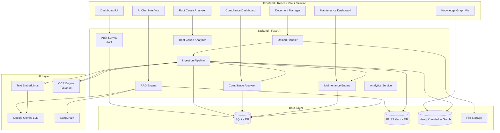
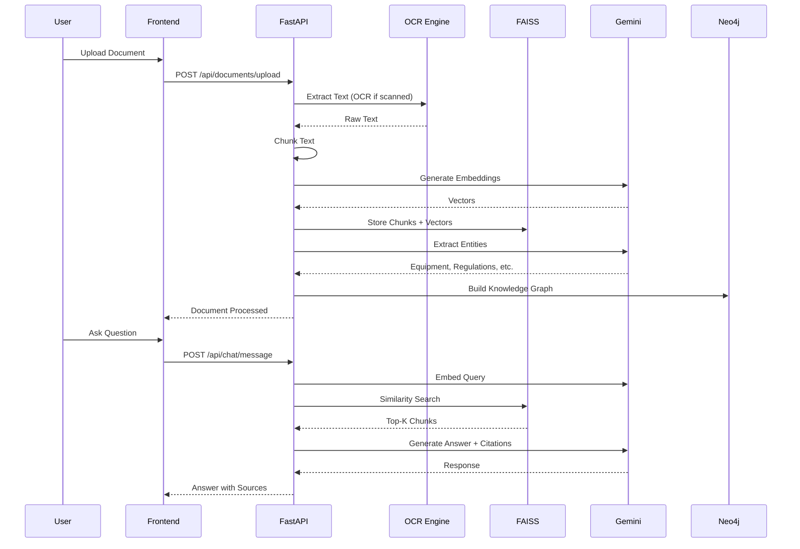

# INDUS-AI System Architecture

```mermaid
flowchart TB
    subgraph Client["Frontend - React + Vite + Tailwind"]
        UI[Dashboard UI]
        DOC[Document Manager]
        CHAT[AI Chat Interface]
        KG[Knowledge Graph Viz]
        COMP[Compliance Dashboard]
        MAINT[Maintenance Dashboard]
        RCA[Root Cause Analyzer]
    end

    subgraph API["Backend - FastAPI"]
        AUTH[Auth Service<br/>JWT]
        UPLOAD[Upload Handler]
        INGEST[Ingestion Pipeline]
        RAG[RAG Engine]
        COMP_SVC[Compliance Analyzer]
        MAINT_SVC[Maintenance Engine]
        RCA_SVC[Root Cause Analyzer]
        ANALYTICS[Analytics Service]
    end

    subgraph AI["AI Layer"]
        GEMINI[Google Gemini LLM]
        EMBED[Text Embeddings]
        LC[LangChain]
        OCR_SVC[OCR Engine<br/>Tesseract]
    end

    subgraph Storage["Data Layer"]
        SQLITE[(SQLite DB)]
        FAISS[(FAISS Vector DB)]
        NEO4J[(Neo4j Knowledge Graph)]
        FILES[File Storage]
    end

    UI --> AUTH
    DOC --> UPLOAD
    CHAT --> RAG
    KG --> NEO4J
    COMP --> COMP_SVC
    MAINT --> MAINT_SVC
    RCA --> RCA_SVC

    UPLOAD --> INGEST
    INGEST --> OCR_SVC
    INGEST --> EMBED
    INGEST --> NEO4J
    INGEST --> COMP_SVC
    INGEST --> MAINT_SVC

    RAG --> FAISS
    RAG --> GEMINI
    RAG --> LC

    AUTH --> SQLITE
    UPLOAD --> FILES
    INGEST --> SQLITE
    INGEST --> FAISS
    COMP_SVC --> SQLITE
    MAINT_SVC --> SQLITE
    ANALYTICS --> SQLITE

    EMBED --> GEMINI
    OCR_SVC --> INGEST
```

## Data Flow

```mermaid
sequenceDiagram
    participant U as User
    participant F as Frontend
    participant B as FastAPI
    participant O as OCR Engine
    participant V as FAISS
    participant G as Gemini
    participant N as Neo4j

    U->>F: Upload Document
    F->>B: POST /api/documents/upload
    B->>O: Extract Text (OCR if scanned)
    O-->>B: Raw Text
    B->>B: Chunk Text
    B->>G: Generate Embeddings
    G-->>B: Vectors
    B->>V: Store Chunks + Vectors
    B->>G: Extract Entities
    G-->>B: Equipment, Regulations, etc.
    B->>N: Build Knowledge Graph
    B-->>F: Document Processed

    U->>F: Ask Question
    F->>B: POST /api/chat/message
    B->>G: Embed Query
    B->>V: Similarity Search
    V-->>B: Top-K Chunks
    B->>G: Generate Answer + Citations
    G-->>B: Response
    B-->>F: Answer with Sources
```
