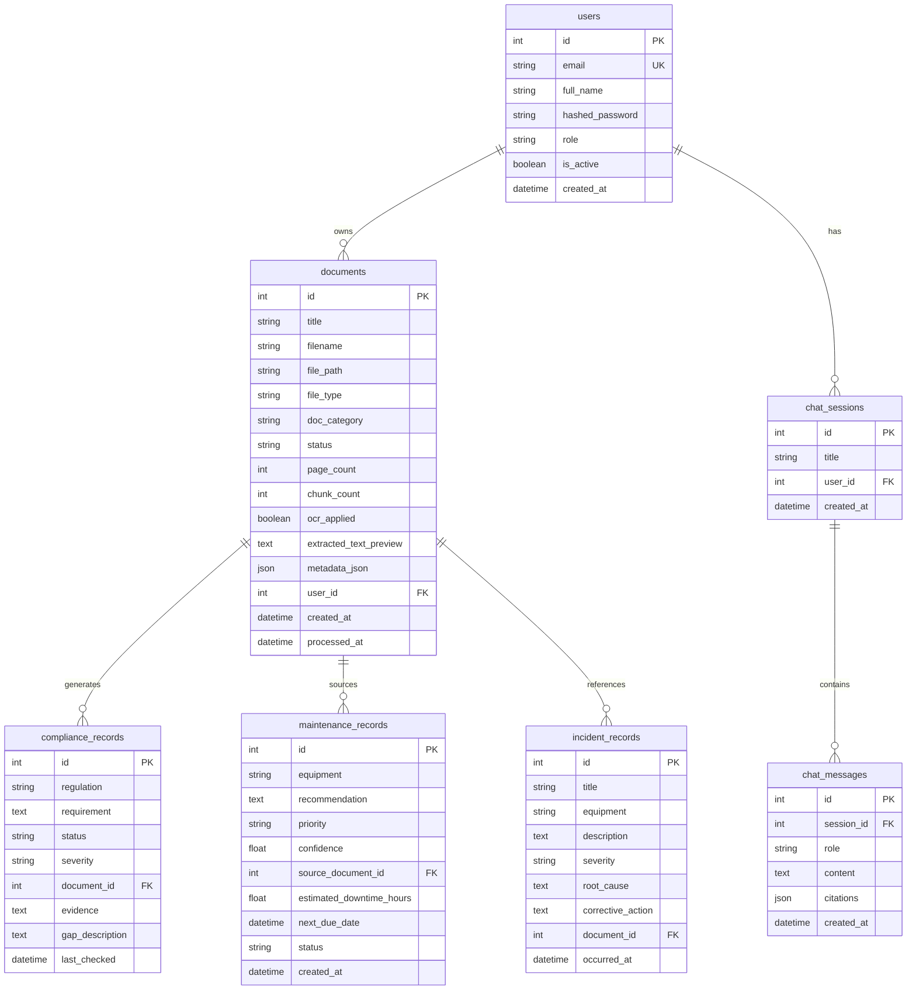

# INDUS-AI Database Schema

## Overview

INDUS-AI uses **SQLite** (development) for relational metadata and **FAISS** for vector storage. **Neo4j** stores the knowledge graph.

---

## Entity Relationship Diagram



---

## Neo4j Graph Schema

```cypher
// Node Labels
(:Document {id, title, category})
(:Equipment {name})
(:Procedure {name})
(:Regulation {name})
(:Incident {name})

// Relationships
(Document)-[:DESCRIBES]->(Equipment)
(Document)-[:DEFINES]->(Procedure)
(Document)-[:REFERENCES]->(Regulation)
(Document)-[:REPORTS]->(Incident)
```

---

## FAISS Vector Store

| Field | Type | Description |
|-------|------|-------------|
| document_id | int | Source document reference |
| document_title | string | Document title for citations |
| chunk_index | int | Chunk sequence number |
| text | string | Chunk text content |
| page | int | Approximate page number |
| embedding | float[768] | Gemini text-embedding-004 vector |

---

## Document Status Flow

```
pending → processing → processed
                    ↘ failed
```

## Compliance Status Values

- `compliant` — Full evidence found
- `partial` — Partial evidence
- `gap` — Missing documentation

## Maintenance Priority Levels

- `high` — Immediate action required
- `medium` — Schedule within 30 days
- `low` — Routine maintenance
